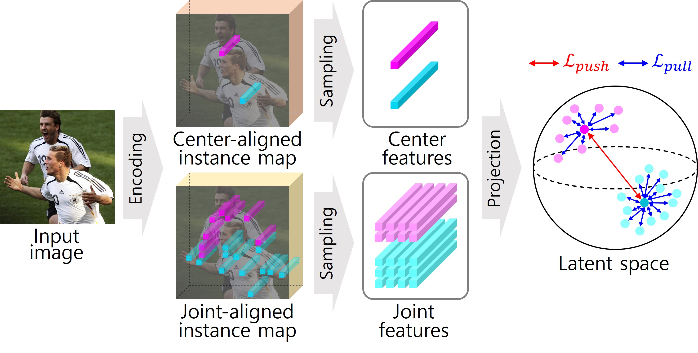
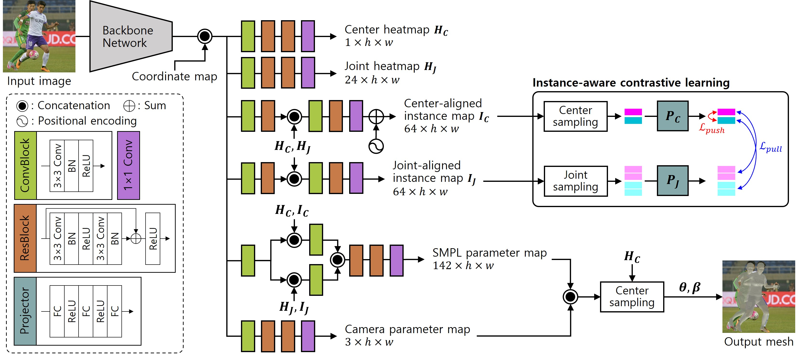

[](https://paperswithcode.com/sota/3d-human-pose-estimation-on-3dpw?p=instance-aware-contrastive-learning-for)

# Instance-aware Contrastive Learning for Occluded Human Mesh Reconstruction

This repository is an official Pytorch implementation of the paper [**"Instance-aware Contrastive Learning for Occluded Human Mesh Reconstruction"**](https://cvpr.thecvf.com/Conferences/2024). <br>
Mi-Gyeong Gwon, Gi-Mun Um, Won-Sik Cheong, Wonjun Kim (Corresponding Author) <br>

:ferris_wheel: ***IEEE/CVF International Conference on Computer Vision and Pattern Recognition (CVPR)***, Jun. 2024. :ferris_wheel:

<br>

## :eyes: Overview 
- We propose to indicate the spatial occupancy of body parts corresponding to each human instance for occlusion-robust 3D human mesh reconstruction. With the awareness of the body part possession of every person, the model can easily understand the person-to-person occlusion and successfully generate human meshes with natural poses.
- We represent the relationship between human instances and their spatial keypoints (i.e., body centers and joints) at the feature level via the proposed instance-aware contrastive learning scheme. Specifically, by guiding the center feature of the target person to push out that of non-target persons and pull corresponding joint features in the latent space, identities of different persons can be distinctively embedded into center and joint features.

<p align="center"></p>
<p align="center">[ Instance-aware contrastive learning ]</p>
<p align="center"></p>
<p align="center">[ Overall architecture ]</p>
<br>

## :gear: How to use it 
### 1. Installation
#### Environment Setting
Please set the environment and datasets by following the guidance of [ROMP repository](https://github.com/Arthur151/ROMP).

#### Model Checkpoints (for evaluation)
Download the [model checkpoint](https://drive.google.com/drive/folders/18xUeyCRONamDA1Njk1QfB3_WEnZPUk0J?usp=sharing) files and place them in `checkpoints` directory.

### 2. Run
#### Evaluation
##### Occlusion-oriented benchmarks
```
$ python -m romp.test --configs_yml=configs/eval_3dpw_test_resnet.yml
$ python -m romp.test --configs_yml=configs/eval_ochuman_resnet_test.yml
$ python -m romp.test --configs_yml=configs/eval_crowdpose_test.yml
```
##### 3DPW Protocol 3 (fine-tuned)
```
$ python -m romp.test --configs_yml=configs/eval_3dpw_test_resnet_ft.yml
$ python -m romp.test --configs_yml=configs/eval_3dpw_test_hrnet_ft.yml
```

## :page_with_curl: Results 
#### Results of 3D human mesh reconstruction by the proposed method on occlusion-oriented benchmark datasets.


## Acknowledgments
This work was supported by Institute of Information Communications Technology Planning & Evaluation (IITP) grant funded by the Korea government (MSIT) (No. 2018-0-00207, Immersive Media Research Laboratory).

Our implementation and experiments are built on top of open-source GitHub repositories. We thank all the authors who made their code public, which tremendously accelerates our project progress. If you find these works helpful, please consider citing them as well.
[Arthur151/ROMP](https://github.com/Arthur151/ROMP)  </br>
