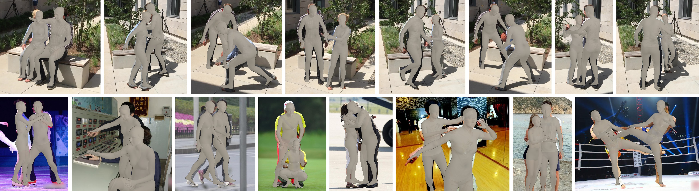

# Instance-aware Contrastive Learning for Occluded Human Mesh Reconstruction

This repository is an official Pytorch implementation of the paper [**"Instance-aware Contrastive Learning for Occluded Human Mesh Reconstruction"**](https://cvpr.thecvf.com/Conferences/2024). <br>
Mi-Gyeong Gwon, Gi-Mun Um, Won-Sik Cheong, Wonjun Kim (Corresponding Author) <br>

:ferris_wheel: ***IEEE/CVF International Conference on Computer Vision and Pattern Recognition (CVPR)***, Jun. 2024. :ferris_wheel:


## Installtion
### Environment Setting
Please set the environment and datasets by following the guidance of [ROMP repository](https://github.com/Arthur151/ROMP).

### Model Checkpoints (for evaluation)
Download the [model checkpoint](https://drive.google.com/drive/folders/18xUeyCRONamDA1Njk1QfB3_WEnZPUk0J?usp=sharing) files and place them in `checkpoints` directory.

## Run
### Evaluation
#### Occlusion-oriented benchmarks
```
$ python -m romp.test --configs_yml=configs/eval_3dpw_test_resnet.yml
$ python -m romp.test --configs_yml=configs/eval_ochuman_resnet_test.yml
$ python -m romp.test --configs_yml=configs/eval_crowdpose_test.yml
```
#### 3DPW Protocol 3 (fine-tuned)
```
$ python -m romp.test --configs_yml=configs/eval_3dpw_test_resnet_ft.yml
$ python -m romp.test --configs_yml=configs/eval_3dpw_test_hrnet_ft.yml
```

## Results
#### Results of 3D human mesh reconstruction by the proposed method on 3DPW (1st row) and COCO (2nd and 3rd rows) datasets.



## Acknowledgments
This work was supported by Institute of Information Communications Technology Planning & Evaluation (IITP) grant funded by the Korea government (MSIT) (No. 2018-0-00207, Immersive Media Research Laboratory).

Our implementation and experiments are built on top of open-source GitHub repositories. We thank all the authors who made their code public, which tremendously accelerates our project progress. If you find these works helpful, please consider citing them as well.
[Arthur151/ROMP](https://github.com/Arthur151/ROMP)  </br>
